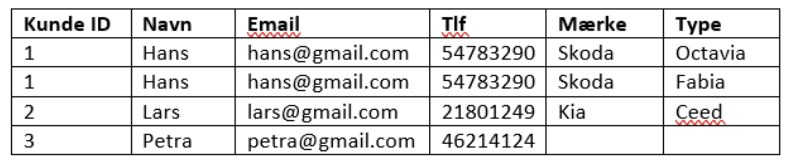
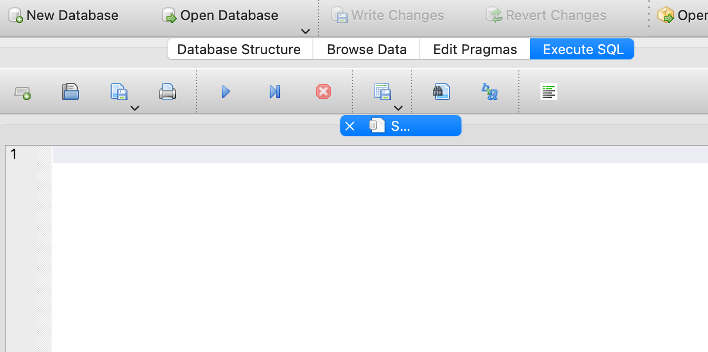

* [Vis som webside.](https://mpsteenstrup.github.io/databaser/)
* [Vis som github side.](https://github.com/mpsteenstrup/databaser/settings/pages)

# Databaser
Vi skal arbejde med databaser og implementere dem i en simpel version på en hjemmeside. 

## Indhold
* [Projektbeskrivelse](#projektbeskrivelse)
* [Tre-lags-arkitektur](#tre-lags-arkitektur-kilde-iftek)
* [Introduktion til databaser med Vestfyn](#introduktion-til-databaser---vestfynedu-style)
* [Normalisering](#normalisering)
* [E/R diagrammer](#er-diagram)
* [DB browser, egen database](#db-browser)
* [SQL kommandoer](#sql-kommandoer)
* [Egen relationel database](#egen-relationel-database)
* [Relationstabel](#relationstabel)
* [Databaser og hjemmesider](#databaser-og-hjemmesider)
* [FN mål](#fn-og-verdensmålene)

## Projektbeskrivelse
Eksamenstiden nærmer sig, og en måde at øve sig på er med flashcards eller quizzer. I skal udvikle en prototype på en quiz- eller flashcard-hjemmeside. Når I udvikler jeres projekt, skal I kombinere databaser med hjemmesideprogrammering.

**IT-løsningen skal indeholde:**
* En HTML-brugerflade, hvor der er tænkt over brugervenligheden. Se teorien her: [interaktionsdesign](https://github.com/mpsteenstrup/InformatikRysensteen/blob/main/dokumenter/Interaktionsdesign.MD).
* Data skal organiseres i en simpel database (f.eks. et regneark), som kan importeres som en CSV-fil med JavaScript.

**I portfolien skal I redegøre for:** 
* Hvordan databasen kan normaliseres ved at gøre den til en relationel database, herunder relationsgraden. Det er ikke nødvendigt at lave selve relationsdatabasen.

## Tre-lags-arkitektur (kilde: [iftek](http://iftek.dk/leksikon:tre-lags-arkitektur))
I en tre-lags-arkitektur inddeles et program i tre lag. Dette er nyttigt i implementeringen af programmer, da de tre lag så vidt muligt holdes adskilte, hvilket gør hele programmet lettere at overskue.

**Præsentationslag:** Det øverste lag, der håndterer modtagelse og præsentation af data. Dette lag er kendetegnet ved at være tæt på brugeren af programmet, ofte i form af en brugergrænseflade.

**Logiklag:** Det midterste lag, der håndterer udvekslingen af data mellem præsentationslaget og datalaget. Dette lag står for beregninger og forretningslogik.

**Datalag:** Det nederste lag, der opbevarer og håndterer data. Dette lag er kendetegnet ved at være tæt på computeren og kan være struktureret som en database.

Vi vil arbejde med, hvordan man organiserer data i databaser.

## Introduktion til databaser - Vestfynedu
I skal bruge den glimrende introduktion til databaser, som findes her: [LINK](https://sites.google.com/vestfynedu.dk/informatikdbg/konstruktion-af-it-systemer/databaser?authuser=0).

### Øvelse
* Læs introduktionen og se videoen "Introduktion til databaser".
* Forklar, hvad entiteter, attributter, primærnøgle og fremmednøgle er.

## Normalisering
Normalisering af en database er en teknik, der sikrer, at rettelser i databasen kan foretages med mindst mulig indflydelse på det oprindelige system. Målet er at minimere redundant data, dvs. at samme oplysning ikke gemmes flere steder. Med normalisering bliver det lettere at foretage rettelser i databasen (så skal man kun rette det ét sted). Læs mere her: [balslev](https://balslev.io/programmering/database/normalisering-af-databaser/).

Normaliseringsregler:
* Unik primærnøgle.
* Ingen kolonne må være afhængig af andre kolonner end primærnøglen.
* Der må kun være én datatype i hver kolonne.
* De samme data skal kun forekomme ét sted (undgå redundans).
* Data skal være relateret til hinanden.

### Øvelse
* Se videoen om normalisering af databaser, start 4 minutter inde: [Video](https://youtu.be/22bRAGYB6Is?t=238).
* Normaliser nedenstående database.


## E/R diagram
Se denne video om E/R diagrammer: [E/R diagrammer](https://youtu.be/wIR-SXl86KY).

### Øvelse
* Se filmen.
* Brug [draw.io](https://app.diagrams.net/) til at lave et E/R diagram over kunde/bil-databasen.

## DB Browser
Vi skal arbejde med et databaseprogram. Det vi bruger er DB Browser for SQLite.
* Download programmet: [DB Browser SQlite](https://sqlitebrowser.org/dl/).
* Download databasen music: [music.db](filer/music.db).
* Åbn music-databasen og prøv de forskellige faner.
* Identificer de forskellige entiteter, attributter og nøgler. 
* Er databasen normaliseret?

## SQL kommandoer
Hvis man arbejder med rigtigt store databaser, er det ikke praktisk at bruge regnearks-repræsentationen til at hente data ud. Det mest udbredte sprog til at arbejde med databaser er SQL (Structured Query Language). Vi bruger SQL-fanen i DB Browser.



### Øvelse
* Prøv de nedenstående kommandoer:
```
SELECT * FROM albums;
SELECT count(*) FROM albums;
SELECT * FROM albums WHERE ArtistId = 2;   
```
* Lav om i sidste linje for at finde ud af, hvilken kunstner der har ArtistId=2.

INNER JOIN er en måde at sætte tabeller sammen på.
### Øvelse
* Kør koden og forklar, hvad der sker ved INNER JOIN:
```
SELECT artists.Name, albums.Title
FROM artists
INNER JOIN albums ON artists.ArtistId = albums.ArtistId;
```
Her er et [cheat sheet](https://res.cloudinary.com/dyd911kmh/image/upload/v1675360372/Marketing/Blog/SQL_Basics_For_Data_Science.pdf).

Pas på med hvad I beder om!


### Øvelse
* Undersøg andre dele af music-databasen.

### Øvelse - egen database
I skal lave jeres egen database. I må selv vælge, hvad databasen skal indeholde, men her er et par forslag:
* Spillere, resultater og turneringer i den lokale skakklub.
* Toppings og isvarianter i den lokale isbar.
* Kunder og varer i en online shop.
* Deltagere på musikfestivaler til sommer.

Som altid er det smart at starte simpelt, så:
* Beskriv kort, hvad indholdet af en simpel version af jeres database er.
* Skitser den som én tabel i et regneark.
* Normaliser databasen, stadig i regneark.
* Lav et E/R-diagram og vurder graden af relationerne.
* Hvis I har en mange-til-mange-relation, så gør den simplere.
* Implementer databasen i DB Browser.

# Databaser og hjemmesider
Vi skal bruge vores viden om databaser til at strukturere indholdet i en hjemmeside. Vi skal bruge JavaScript til at loade data og for at kunne bruge det. JavaScript er godt, hvis man vil lave interaktive hjemmesider.

Her er en hjemmeside, hvor informationen om de forskellige FN verdensmål er gemt som en kommasepareret fil (CSV): [https://mpsteenstrup.github.io/databaser/filer/FN_goals_loaddata.html](https://mpsteenstrup.github.io/databaser/filer/FN_goals_loaddata.html)

### Øvelse
* Hvorfor er det en god idé at adskille indhold fra struktur og layout på en hjemmeside?
* Beskriv, hvad de tre formater, ```html```, ```css```, ```JavaScript```, bruges til på en hjemmeside.

## Introduktion til JavaScript

### Eksempel
Første eksempel er en knap, som kan vise tid og dato: [https://mpsteenstrup.github.io/databaser/filer/ex1.html](https://mpsteenstrup.github.io/databaser/filer/ex1.html).

Koden ser sådan ud:

```
<!DOCTYPE html>
<html>
<body>

<h2>Ex 1</h2>

<button type="button" onclick="getDate()"> Tid og dato</button>
<p id="demo"></p>

</body>
</html> 

<script>
    function getDate(){
        document.getElementById('demo').innerHTML = Date();
    }
</script>
```
De første 3 linjer er HTML-setup og så en overskrift "Ex 1". Det nye er, at vi laver en knap:
```
<button type="button" onclick="getDate()"> Tid og dato</button>
```
Typen er sat med ```type="button"```, og den kalder funktionen ```getDate()``` ved kommandoen ```onclick="getDate()"```.

JavaScript-delen er i ```<script>```-tags og kan placeres nederst på siden. Funktionen bliver defineret med ```function getDate() { }``` og har kun én linje kode.

```document.getElementById('demo').innerHTML = Date();```
finder det element på siden med ```id="demo"``` og sætter det lig ```Date()```, som er en indbygget funktion i JavaScript til at give tid og dato.

### Øvelse
* Kopier koden ind i et VSCode-dokument og kør den. Det er også muligt at bruge w3schools online editor: [https://www.w3schools.com/tryit/tryit.asp?filename=tryhtml_hello](https://www.w3schools.com/tryit/tryit.asp?filename=tryhtml_hello).
* Prøv at ændre koden, så den i stedet fortæller en joke, når man trykker på knappen. Husk, at tekst skal stå i gåseøjne (" ").

## Data og hjemmesiden
Vi skal nu bruge vores nyvundne JS-skills til at loade data. Data skal være gemt som CSV-fil og have overskrift på alle kolonner.

### Eksempel 2: Load biler-databasen
Eksemplet kan hentes her: [https://mpsteenstrup.github.io/databaser/filer/ex2.zip](https://mpsteenstrup.github.io/databaser/filer/ex2.zip).

Vi vil loade databasen ```filer/biler.csv```, som indeholder:
```
bilID,type,mærke
1,Octavia,Skoda
2,Fabia,Skoda
3,Ceed,Kia
```
Hjemmesiden kan ses her: [https://mpsteenstrup.github.io/databaser/filer/ex2.html](https://mpsteenstrup.github.io/databaser/filer/ex2.html). Hvis man bruger Google Chrome, kan man se JavaScript-konsollen ved at gå ind under ```Vis->Udvikler->JavaScript-konsol```. Så kan I se, at data ligger i et format kaldet en "dictionary":
```
0: {bilID: '1', type: 'Octavia', mærke: 'Skoda'}
1: {bilID: '2', type: 'Fabia', mærke: 'Skoda'}
2: {bilID: '3', type: 'Ceed', mærke: 'Kia'}
```
For at få fat i informationen om mærket i første linje skal man skrive ```data[0]["mærke"]```. Som før indsætter vi informationen i dokumentet med koden ```document.getElementById('biler').innerHTML = data[0]["mærke"] + " " + data[0]["type"];```

For at kunne holde styr på data bruger vi biblioteket Papa, som kan loades med denne kommando:
```<script src="https://cdnjs.cloudflare.com/ajax/libs/PapaParse/5.3.0/papaparse.min.js"></script>```

Data bliver loadet i denne del af koden, når hjemmesiden loades:
```
window.onload = function() {
  var xhr = new XMLHttpRequest();
  xhr.open("GET", "biler.csv", true);
  xhr.responseType = "text";
  xhr.onload = function() {
    data = Papa.parse(xhr.responseText, { header: true }).data;
  };
  xhr.send();
}
```
Det er ok at tage denne del som lidt af en "black box", men den sender en HTML-request om at åbne filen "biler.csv" og gemmer det i variablen ```data```.

### Øvelse
* Hent de to filer, ex2.html og biler.csv, fra mappen ```filer``` og prøv at køre programmet i VSCode. Det er ikke muligt bare at klikke på HTML-filen på grund af sikkerhedsbekymringer.
* Ændr filen, så noget andet bliver vist.

## FN og verdensmålene
Vi vender nu tilbage til hjemmesiden med FNs verdensmål: [FN_goals_loaddata.html](https://mpsteenstrup.github.io/databaser/filer/FN_goals_loaddata.html). Filen kan ses her: [FN_goals_loaddata.html koden](https://github.com/mpsteenstrup/databaser/blob/main/filer/FN_goals_loaddata.html).

Koden indeholder fire JavaScript-funktioner: ```ny()```, ```valgte()```, ```genererTekst()``` og den, som loader data. Ideen er, at koden vælger en overskrift og en beskrivelse, der passer til de forskellige verdensmål.

### Øvelse
* Beskriv, hvad der sker i linje 28, 29, 30 og 31, og hvordan det hænger sammen med selve HTML-koden.

For at udvælge teksten bruges funktionen ```genererTekst(x)```, som tager det tilfældige heltal mellem 0 og 3 som argument. Her er koden:
```
function genererTekst(x){
  for (var i = 0; i < data.length; i++) {
      if (data[i]["ID"] == x) {
        overskrift = data[i]['overskrift']; 
        beskrivelse = data[i]['beskrivelse'];
        break; // exit efter loop
      }
  }
}
```
Anden linje ```for (var i = 0; i < data.length; i++)``` giver en løkke, hvor ```i=0``` til at starte med, og i vokser med 1 (```i++```) for hver omgang. Løkken kører, så længe ```i < data.length```, altså så længe i er mindre end antallet af rækker i data.

Betingelsen ```if (data[i]["ID"] == x)``` bruger primærnøglen ```ID``` og spørger, om den er lig med ```x```. Hvis den er det, så skal overskrift og beskrivelse opdateres, og løkken stoppes.

### Øvelse
* Beskriv, hvorfor ```genererTekst(x)```-funktionen virker.
Databasen indeholder også en kolonne ```progression```, hvor det er angivet, hvor langt vi som verden er kommet med verdensmålene.
* Lav om i koden, så denne information også bliver vist på siden.


