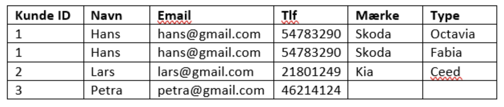

# Databaser

## Tre-lags-arkitektur, (kilde [iftek](http://iftek.dk/leksikon:tre-lags-arkitektur))
I en trelagsarkitur indeles et program i tre lag, hvilket er er nyttigt i implementeringen af programmer, da de tre lag så vidt mulig holdes adskilte og dermed er hele programmet lettere at overskue.

**Præsentationslag:** Det øverste lag der håndterer modtagelse og præsentation af data. Dette lag er kendetegnet ved at være ”tæt” på brugeren af programmet.

**Logiklag:** Det midterste lag der håndterer udvekslingen af data mellem præsentationslaget og datalaget.

**Datalag:** Det nederste lag der opbevarer og håndterer data. Dette lag er også kendetegnet ved at være ”tæt” på computeren.

Vi vil arbejde med hvordan man organiserer data i databaser.

## Introduktion til databaser - Vestfynedu style.
I bruger den glimrende introduktion til databaser [LINK](https://sites.google.com/vestfynedu.dk/informatikdbg/konstruktion-af-it-systemer/databaser?authuser=0).

### Øvelse
* Læs introduktionen og se videoen Introduktion til databaser. 
* Forklar hvad Entiteter, Attributter, primærnøgle og sekundærnøgle er. 

### Øvelse
* Se videoen om normalisering af databaser, start 4 minutter inde [Video](https://youtu.be/22bRAGYB6Is?t=238).
* Normaliser nedenstående database.

## DB Browser
Vi skal arbejde med et databaseprogram. Det vi bruger er DB Browser SQlite.
* Download programmet, [DB Browser SQlite](https://sqlitebrowser.org/dl/).
* Download databasen music, [music.db](filer/music.db).
* Åben music databasen og prøv de forskellige faner.
* Identificer de forskellige Entiteter, Attributter og nøgler. 
* Er databasen normaliseret?

## SQL kommandoer
Hvis man arbejder med rigtigt store databaser er det ikke praktisk at bruge regnearksrepresentationen til at hente data ud. Den mest udbredte sprog til at arbejde med databaser er SQL, Structured Query Language. Vi bruger SQL fanen i BD Browser,

* Her er et [cheat sheet](https://res.cloudinary.com/dyd911kmh/image/upload/v1675360372/Marketing/Blog/SQL_Basics_For_Data_Science.pdf).

### Øvelse
* Brug cheat sheetet til at undersøge music databasen.

## E/R diagram
Endnu en fin video, nu om E/R diagrammer.

### Øvelse
* se filemn [Kunsten at lave E/R-diagrammer](https://youtu.be/wIR-SXl86KY).
* Brug [draw.io](https://app.diagrams.net/) til at lave et E/R diagram over kunde/bil databasen.

